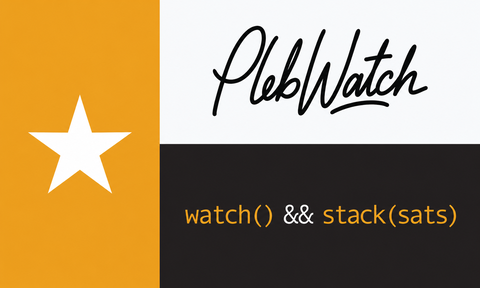

# PlebWatch

<p align="center">
  
</p>

<p align="center">
  <strong>Battery-friendly Bitcoin watch + dashboard for the M5StickC Plus2</strong><br>
  Inspired by <a href="https://bitcoin.clarkmoody.com/dashboard/">Clark Moody Dashboard</a> · metrics from <a href="https://mempool.space/">mempool.space</a> · <code>watch() && stack(sats)</code>
</p>

### See it in action

<p align="center">
  
</p>

<p align="center">
  <sub>30s GIF preview · <a href="https://impress.plebtv.com/v/plebwatch-idea-e8841cfb">full walkthrough on PlebTV</a></sub>
</p>

---

## What it does

PlebWatch turns an **M5StickC Plus2** into a pocket Bitcoin companion: analog watch face on the brand art, live chain + Lightning metrics, and deep sleep so it can run untethered on the 200 mAh cell for about **1–3 days**.

| Feature | Details |
|---|---|
| **Brand splash + watch** | Full-bleed PlebWatch flag art; **rectangular perimeter ticks** + sword hands (no circular overlay) |
| **Based Mode** | Orange **`1 sat = 1 sat`** — keep stacking |
| **Live markets** | BTC/USD, sats per dollar, tip block height |
| **Fee estimates** | Immediate / hour / day / week + mempool size |
| **Mining** | Hashrate, difficulty, retarget, block time |
| **Halving countdown** | Blocks left, subsidy, estimated date |
| **Lightning** | Capacity, USD value, nodes/channels, top LN nodes |
| **Satoshi Quotes** | Random quote each wake from [The Quotable Satoshi](https://satoshi.nakamotoinstitute.org/quotes/) by the [Satoshi Nakamoto Institute](https://nakamotoinstitute.org/) |
| **Smart clock** | NTP after Wi‑Fi; **timezone from Wi‑Fi IP location** (never UTC — falls back to `PLEBWATCH_TZ`) |
| **Time through sleep** | BM8563 RTC keeps running offline; watch + header share one clock |
| **Multi Wi‑Fi** | Tries your known 2.4 GHz networks in order (home, hackerspace, …) |
| **Battery mode** | Deep sleep ~**60 min** on battery; show UI ~**3 min**; button wakes early / extends awake; faster refresh while charging |
| **New block beep** | Short tone when tip height moved since last wake |

## Buttons

| Control | Action |
|---|---|
| **A** short | Next page |
| **A** long | Jump back to Watch |
| **B** | Brightness cycle |

### Page cycle
**Watch → Based Mode → Markets → Fees → Mining → Halving → Lightning → Top nodes → Satoshi Quotes**

---

## Quick start

```bash
git clone https://github.com/thrillerxx/plebwatch.git
cd plebwatch

cp include/config.h.example include/config.h
# edit include/config.h — real SSIDs + passwords

# PlatformIO (if needed):
#   python3 -c "$(curl -fsSL https://raw.githubusercontent.com/platformio/platformio-core-installer/master/get-platformio.py)"
#   export PATH="$HOME/.platformio/penv/bin:$PATH"

pio run -t upload
pio device monitor
```

After flash: splash → Wi‑Fi → **Time sync…** (geo‑IP TZ + NTP) → metrics → watch face → deep sleep.

## What you need

### Hardware
| Item | Notes |
|---|---|
| [M5StickC Plus2](https://docs.m5stack.com/en/core/M5StickC%20PLUS2) | Required (HOLD pin / power path differ on older Sticks) |
| USB‑C data cable | Charge-only cables will not flash |
| Wi‑Fi **2.4 GHz** | ESP32 cannot join 5 GHz-only networks |

### Software
| Item | Notes |
|---|---|
| [PlatformIO Core](https://platformio.org/install/cli) | Or PlatformIO IDE / VS Code extension |
| Git | Clone the repo |
| Serial group | Arch: `uucp` · Debian/Ubuntu: `dialout` |

---

## Full walkthrough

### 1. Clone
```bash
git clone https://github.com/thrillerxx/plebwatch.git
cd plebwatch
```

### 2. Configure Wi‑Fi
```bash
cp include/config.h.example include/config.h
```

```cpp
static const WifiCred WIFI_NETWORKS[] = {
    {"MyHomeSSID", "my-home-password"},
    {"OfficeSSID", "office-password"},
};
```

- Tried **in order** on every wake  
- `PLEBWATCH_TZ` is the fallback if geo‑IP returns UTC or fails  


- Never commit `include/config.h` (gitignored)

### 3. PlatformIO (Linux)
```bash
python3 -c "$(curl -fsSL https://raw.githubusercontent.com/platformio/platformio-core-installer/master/get-platformio.py)"
export PATH="$HOME/.platformio/penv/bin:$PATH"
```

### 4. Serial permissions
```bash
# Arch Linux
sudo usermod -aG uucp $USER

# Debian / Ubuntu
sudo usermod -aG dialout $USER
```

Log out and back in, then:

```bash
curl -fsSL https://raw.githubusercontent.com/platformio/platformio-core/develop/platformio/assets/system/99-platformio-udev.rules \
  | sudo tee /etc/udev/rules.d/99-platformio-udev.rules
sudo udevadm control --reload-rules && sudo udevadm trigger
```

### 5. Plug in the Stick
```bash
ls /dev/ttyACM* /dev/ttyUSB*
lsusb   # Espressif / QinHeng UART
```

### 6. Build & flash
```bash
export PATH="$HOME/.platformio/penv/bin:$PATH"
cd plebwatch
pio run -t upload
```

### 7. First boot
1. PlebWatch splash (~8s)  
2. `WiFi…` → `Time sync…` → `Fetching…`  
3. Analog watch on the brand art  

Press **A** to tour Based Mode and the Clark‑Moody‑style pages.

### 8. Battery / sleep
| Situation | Behavior |
|---|---|
| On battery | Show UI ~**3 min**, deep sleep **60 minutes**, wake & refresh |
| Charging / USB | Show UI ~**3 min**, refresh about every **3 minutes** |
| Button | Wakes from sleep; while awake, resets the 3‑minute on-screen timer |
| New block | Short beep |
| No Wi‑Fi | RTC clock still runs; metrics from last cache when available |

Expect roughly **1–3 days** untethered if you let it sleep. Always-on screen drains the 200 mAh cell in hours. The clock itself keeps ticking offline via the BM8563.

### 9. Make it yours
- Currency (API also has EUR, GBP, …)  
- Pages in `src/ui.cpp` + `include/metrics.h`  
- Sleep intervals in `src/main.cpp`  
- Your own mempool instance in `src/mempool_client.cpp`  
- Swap splash art → regenerate `include/splash_image.h`

## Project layout
```
plebwatch/
  assets/plebwatch-banner.png   # README / brand banner
  assets/plebwatch-face.png     # 240×135 splash & watch background
  platformio.ini
  include/config.h.example
  include/splash_image.h        # embedded RGB565 splash
  include/local_clock.h         # RTC + shared clock (12h AM/PM)
  include/watch_face.h
  src/main.cpp                  # boot, buttons, deep sleep
  src/local_clock.cpp
  src/watch_face.cpp            # splash + analog dial, Based Mode
  src/wifi_connect.cpp
  src/mempool_client.cpp        # geo-IP TZ, NTP, metrics
  src/ui.cpp                    # dashboard pages
```

## Troubleshooting

| Problem | Fix |
|---|---|
| No `/dev/ttyACM*` | Other cable/port; hold power; check `lsusb` |
| Permission denied | `uucp`/`dialout` + udev rules |
| `No WiFi` | 2.4 GHz only; check SSID/password |
| Wrong local time | Needs Wi‑Fi sync; VPN/datacenter IPs can confuse geo‑TZ (UTC is rejected → `PLEBWATCH_TZ`) |
| Black screen after unplug | Plus2 HOLD pin — use this firmware |
| Dies in under an hour | Screen staying on; let it deep-sleep |
| Fetch fail | Captive portal / firewall blocking HTTPS |

## Credits & attribution

### Clark Moody Dashboard
Dashboard layout/metrics inspiration from **[Clark Moody Bitcoin](https://bitcoin.clarkmoody.com/dashboard/)**.

PlebWatch is **not affiliated with Clark Moody**. If you find value in his work, please [donate to Clark Moody Bitcoin](https://bitcoin.clarkmoody.com/donate/).

### Satoshi Nakamoto Institute
**Satoshi Quotes** are sourced from *[The Quotable Satoshi](https://satoshi.nakamotoinstitute.org/quotes/)*, curated by the **[Satoshi Nakamoto Institute](https://nakamotoinstitute.org/)**.

- Quotes & dataset: [satoshi.nakamotoinstitute.org/quotes](https://satoshi.nakamotoinstitute.org/quotes/)
- Institute: [nakamotoinstitute.org](https://nakamotoinstitute.org/)

Original words by **Satoshi Nakamoto**. Compilation and presentation courtesy of the Satoshi Nakamoto Institute — thank you for preserving this history. This project is **not affiliated with SNI**; please [support their work directly](https://nakamotoinstitute.org/donate/).

### mempool.space
Public chain, fee, mining, and Lightning metrics are fetched from **[mempool.space](https://mempool.space/)**.

PlebWatch is **not affiliated with mempool.space**. For production / higher-rate access, please [purchase mempool.space Enterprise](https://mempool.space/enterprise).

## License
MIT — see [LICENSE](LICENSE). Fork it, flash it, stack sats.

Satoshi Nakamoto Institute, Clark Moody, and mempool.space materials remain under their respective terms; only the PlebWatch firmware code in this repo is MIT-licensed.
